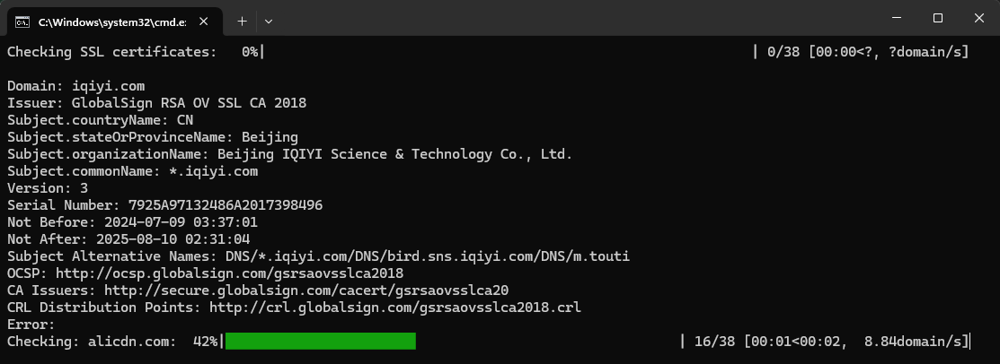
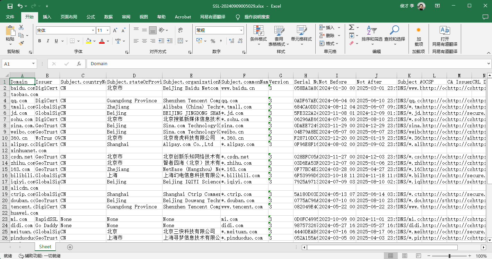

# Domain Analyzer

- Author: Li Juncai
- License: [MIT](./LICENCE)
- Email: [291148484@163.com](mailto:291148484@163.com)
- Screenshots:




## 1. Introduction

This is a **Python**-based domain analysis tool designed for batch processing and analysis of multiple domains. The tool can read a list of domains, retrieve various information including SSL certificates, DNS records, and other domain-related data, then save the results to an Excel file.

## 2. Features

The main features of this tool include:

- Reading domain lists from text files
- Retrieving SSL certificate information for each domain
- Performing DNS lookups and gathering DNS records
- Checking domain registration information (WHOIS data)
- Supporting customizable output fields
- Saving results to Excel files
- Displaying progress with a progress bar
- Supporting custom settings via a configuration file

## 3. Installing Dependencies

Before using this tool, you need to install the required **Python** libraries. You can install the dependencies using the following command:

```bash
pip install pyyaml openpyxl tqdm cryptography pyOpenSSL dnspython python-whois
```

## 4. Configuration File

The tool uses a **YAML** format configuration file `configs.yaml`. The main configuration items include:

- `domains_file`: Path to the domain list file
- `output_directory`: Output directory
- `ssl_timeout`: SSL connection timeout
- `excel_prefix`: Prefix for the output Excel file name
- `include_errors`: Whether to include error information
- `output_fields`: List of output fields
- `progress_bar`: Progress bar configuration
- `analysis_modules`: List of analysis modules to run (e.g., SSL, DNS, WHOIS)

You can modify the `configs.yaml` file to customize the tool's behavior as needed.

## 5. Usage

1. Prepare a text file containing a list of domains, with one domain per line.

2. Ensure that the `domains_file` setting in `configs.yaml` correctly points to your domain list file.

3. Run the script:

```bash
python domain_analyzer.py
```

4. The script will start processing the domain list, displaying a progress bar and information about the currently processed domain.

5. After processing is complete, the results will be saved in the configured output directory with a filename format of `DomainAnalysis-YYYYMMDDHHMMSS.xlsx`.

## 6. Output Results

The output Excel file contains the following information (customizable via the configuration file):

- Domain
- SSL Certificate Information (if enabled)
  - Issuer, Subject, Validity, etc.
- DNS Records (if enabled)
  - A, AAAA, MX, TXT, etc.
- WHOIS Information (if enabled)
  - Registrar, Creation Date, Expiration Date, etc.
- Error Information (if any)

## 7. Notes

- Ensure you have sufficient permissions to read the domain list file and write to the output directory.
- Processing a large number of domains may take a considerable amount of time. Please be patient.
- Some analysis modules (e.g., WHOIS lookups) may have rate limits. Consider implementing delays between requests if necessary.
- If encoding issues are encountered, the tool will attempt to read files using both UTF-8 and GBK encodings.

## 8. Troubleshooting

If you encounter any issues, please check the following:

- Ensure all dependency libraries are correctly installed.
- Verify that the `configs.yaml` file is formatted correctly.
- Check if the domain list file exists and is formatted correctly.
- Ensure the output directory is writable.
- For WHOIS-related issues, make sure you have the necessary permissions and your IP is not being rate-limited.

If problems persist, review the error messages for more clues.

## 9. Contributing

Contributions to the Domain Analyzer are welcome! Please feel free to submit pull requests, create issues or spread the word.

## 10. License

This project is licensed under the MIT License - see the [LICENSE](./LICENSE) file for details.
