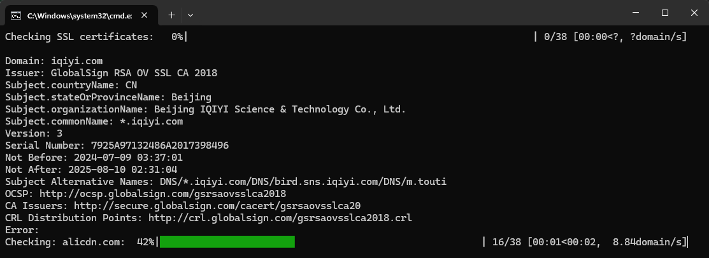

# 域名分析器

- 作者：李俊才
- 协议：[MIT](./LICENCE)
- 邮箱：[291148484@163.com](mailto:291148484@163.com)
- 截图：




## 1. 简介

这是一个基于 **Python** 的域名分析工具，用于批量处理和分析多个域名。该工具可以读取域名列表，获取包括 SSL 证书、DNS 记录和其他域名相关数据在内的各种信息，并将结果保存到 Excel 文件中。

## 2. 功能特点

本工具具有以下主要功能：

- 从文本文件中读取域名列表
- 获取每个域名的 SSL 证书信息
- 执行 DNS 查询并收集 DNS 记录
- 检查域名注册信息（WHOIS 数据）
- 支持自定义输出字段
- 将结果保存为 Excel 文件
- 使用进度条显示处理进度
- 支持配置文件自定义设置

## 3. 安装依赖

在使用本工具之前，需要安装所需的 **Python** 库。可以使用以下命令安装依赖：

```bash
pip install pyyaml openpyxl tqdm cryptography pyOpenSSL dnspython python-whois
```

## 4. 配置文件

工具使用 **YAML** 格式的配置文件 `configs.yaml`。主要配置项包括：

- `domains_file`: 域名列表文件路径
- `output_directory`: 输出目录
- `ssl_timeout`: SSL 连接超时时间
- `excel_prefix`: 输出 Excel 文件名前缀
- `include_errors`: 是否包含错误信息
- `output_fields`: 输出字段列表
- `progress_bar`: 进度条配置
- `analysis_modules`: 要运行的分析模块列表（如 SSL、DNS、WHOIS）

可以根据需要修改 `configs.yaml` 文件来自定义工具的行为。

## 5. 使用方法

1. 准备一个包含域名列表的文本文件，每行一个域名。

2. 确保 `configs.yaml` 文件中的 `domains_file` 设置正确指向域名列表文件。

3. 运行脚本：

```bash
python domain_analyzer.py
```

4. 脚本将开始处理域名列表，并显示进度条和当前处理的域名信息。

5. 处理完成后，结果将保存在配置的输出目录中，文件名格式为 `DomainAnalysis-YYYYMMDDHHMMSS.xlsx`。

## 6. 输出结果

输出的 Excel 文件包含以下信息（可通过配置文件自定义）：

- 域名
- SSL 证书信息（如果启用）
  - 颁发者、主题、有效期等
- DNS 记录（如果启用）
  - A、AAAA、MX、TXT 等
- WHOIS 信息（如果启用）
  - 注册商、创建日期、过期日期等
- 错误信息（如果有）

## 7. 注意事项

- 确保有足够的权限读取域名列表文件和写入输出目录。
- 对于大量域名的处理可能需要较长时间，请耐心等待。
- 某些分析模块（如 WHOIS 查询）可能有速率限制。如有必要，请考虑在请求之间实施延迟。
- 如果遇到编码问题，工具会尝试使用 UTF-8 和 GBK 编码读取文件。

## 8. 故障排除

如果遇到问题，请检查以下几点：

- 确保所有依赖库都已正确安装。
- 验证 `configs.yaml` 文件的格式是否正确。
- 检查域名列表文件是否存在且格式正确。
- 确保输出目录可写入。
- 对于 WHOIS 相关问题，确保您有必要的权限，且您的 IP 未被限制速率。

如果问题仍然存在，可以查看错误信息以获取更多线索。

## 9. 贡献

欢迎对域名分析器项目做出贡献！请随时提交拉取请求、创建问题或传播该项目。

## 10. 许可证

本项目采用 MIT 许可证 - 有关详细信息，请参阅 [LICENSE](./LICENSE) 文件。
